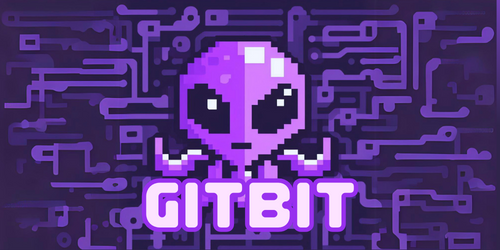

  
  <h1>🐙GITBIT👾</h1>
  <h2>Simple Conventional Commit.</h2>

> Inspirado en la idea de [GITMOJI](https://gitmoji.dev/)

## Qué?

Una hoja de trucos para escribir commits fáciles de identificar, leer, entender y comunicar. Una alternativa sencilla de GITMOJI.

## Porqué?

GITMOJI es una gran opción para usar convencional commits en un proyecto. Sin embargo, considero que se puede simplificar y ese es el propósito de GITBIT.

La idea de poner emojis antes de un "commit message" es muy util para identificar de que se trata el commit, al ser llamativo y con la relación de imagen - concepto, el proceso de identificación es muy rápido e intuitivo.

## El propósito

El propósito es que puedas comunicar mejor los commits haciéndolos declarativos, usando verbos e ideas que se sustituyan por emojis. 

### Como funciona

Asi como es más fácil mientras conduces identificar la señal de alto "🛑"  en lugar de leer Señal de alto. GITBIT funciona de la misma forma en lugar de leer la acción,verbo e idea, ves un símbolo. Ejemplo:

_Sin_ 

`Creación de Modulo Para Autenticación.`.

_Usando GITBIT_

`✅ Modulo de Autenticación`.

En este ejemplo el símbolo sustituye la palabra Creación o Hecho por ✅. Lo cual lo hace más fácil y rápido de leer. Incluso antes de leer lo que se hizo ya sabes que se tratara de una implementación de código/funcionalidad.

El funcionamiento es sustituir acciones/verbos más comunes en los commits por emojis/símbolos.

## Composición

> [!NOTE] 
> **Recomendación:**
Escribe los mensajes de los commits de forma clara y sencilla.

> [!WARNING]
> ***Importante:** No subir cambios que generen errores en desarrolló o que interrumpa la continuidad de cierto proceso.

| SÍMBOLO  | REPRESENTACIÓN \| SIGNIFICADO                                                                                                                                | Descripción                                                                                                                                                                | EJEMPLO                     |
|----------|--------------------------------------------------------------------------------------------------------------------------------------------------------------|----------------------------------------------------------------------------------------------------------------------------------------------------------------------------|-----------------------------|
| 👾        | [Iniciando Proyectó /Initiating Project, Primer Commit/ First Commit]                                                                                        | El hola mundo de GITBIT. Úsalo como primer commit.                                                                                                                         | 👾 GITBIT                    |
| ✅        | [Hecho/Done, Creado/Create, Completado/ Complete, Terminado/ Finished]                                                                                       | Indica que subiste una nueva funcionalidad, implementación de código nuevo, componente o la terminación de un código.                                                      | ✅ Modulo de Compra          |
| 🐞        | [Corrección /Fix, Reparación / Repair, Solución de error/ Fix Bug ]                                                                                          | Indica que el cambio es para la corrección de un BUG o algún tipo de error.                                                                                                | 🐞 Hover Botón de Compra     |
| ⚙️        | [Trabajo en procesó, Work in Progress, En procesó/ In Progress, Aun sin terminar/ Not Yet Finished]                                                          | Indica que has subido un cambio sin errores, pero incompleto en el cual se esta trabajando.                                                                                | ⚙️ Modal de confirmación     |
| 🚧        | [Precaución/ Caution, Por comprobar/ To be Checked]                                                                                                          | Indica que has subido un cambio sin errores pero que falta por comprobar el 100% de los casos. Funciona, pero puede fallar en algún caso.                                  | 🚧 Modulo de impresión       |
| ❌        | [ Eliminación de Código / Delete Code, Eliminación de Comentarios / Delete Comments]                                                                         | Indica que has hecho una eliminación de cierto contenido relacionado con el código que ya no se usa, innecesario, etc.                                                     | ❌ Modulo de visitantes      |
| ⬇️        | [Instalación de un Paquete/ Add Package, Nueva dependencia / New Dependency]                                                                                 | Indica que has agregado una nueva dependencia (estética o funcional) al proyecto, Ayuda a saber si se tiene que hacer una instalación por ejemplo un (npm i)               | ⬇️ Toastify                  |
| ✖️        | [Eliminación de dependencia / Uninstall Dependency]                                                                                                          | Indica que has eliminado una dependencia (estética o funcional) al proyecto. No debe irrumpir el funcionamiento del código. Por lo que es bueno tener su remplazo estable. | ✖️ SweetAlert                |
| 🗑️        | [Eliminación multimedia o de recursos/ Multimedia removal]                                                                                                   | Indica que has eliminado un archivo multimedia de tu proyecto.                                                                                                             | 🗑️ Main Banner               |
| 💎        | [Refactorización de código/ Code Refactor, Mejora de estructura / Better Structure ]                                                                         | Indica que has hecho una refactorizacion de código, una mejora no funcional pero si en calidad de codigo u orden del proyecto.                                             | 💎 Modulo de Carrito         |
| ✨        | [Cambio de Diseño/ Design, Cambio Estético/Esthetic Change, Mejora de UI/ Better UI ]                                                                        | Indica un cambio meramente estético que no interfiere en la funcionalidad del código. No rompe el ser del proyecto.                                                        | ✨ Colores en Títulos        |
| ✍️        | [Mejora de documentación/ Better Docs, Mejoras ortográficas o semánticas/ Spelling or semantic improvements, Añadido de contenido textual/ Add Text Content] | Indica un cambio de contexto escrito, No rompe ni altera el funcionamiento                                                                                                 | ✍️ Readme                    |
| 🪄        | [Mejora en el Formato del Código/ Better Code Formatting ]                                                                                                   | Indica un formateo en el código, No rompe ni altera el funcionamiento de la aplicación. Recomendado indicar el lugar                                                       | 🪄 En Modulo de Exportación  |
| 🚀        | [ Desplegar/Deploy, Implementación/ Implementation ]                                                                                                         | Indica cambios relacionados con el Deploy del proyecto. Cambios que tiene que ver con el despliegue.                                                                        | 🚀 Vercel Config             |